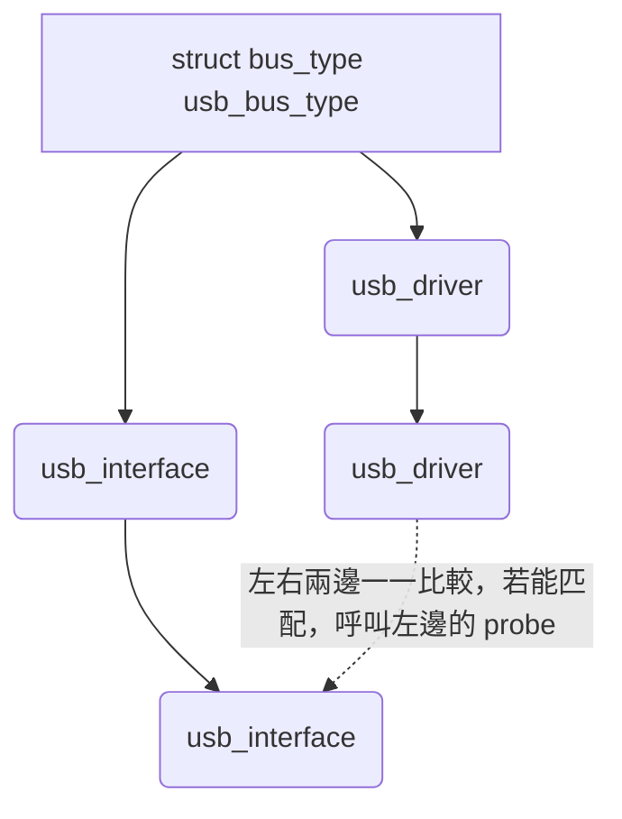

# 驅動模型

```mermaid
graph TD
    A["struct bus_type usb_bus_type"]
    B(usb_driver)
    C(usb_interface)
    D(usb_driver)
    E(usb_interface)

    A --> B
    A --> C
    B --> D
    C --> E

    D -.->|左右兩邊一一比較，若能匹配，呼叫左邊的 probe| E
```